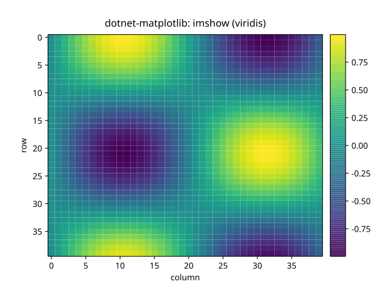
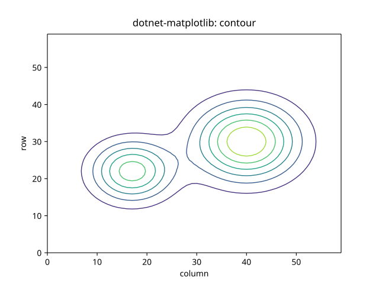
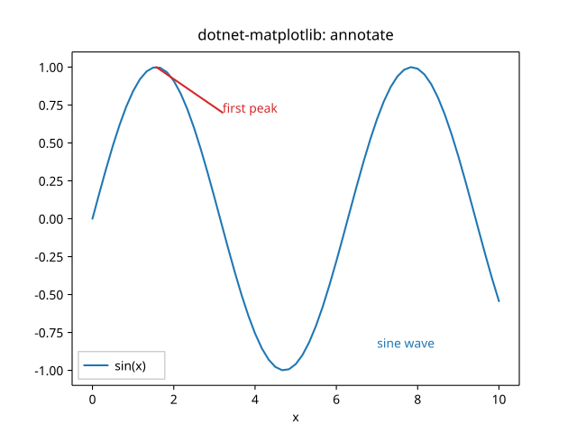
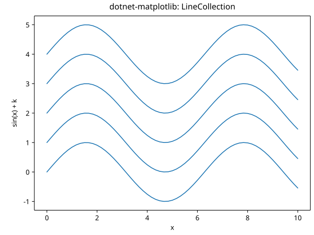

# dotnet-matplotlib

[](https://dotnet.microsoft.com/)
[](https://www.nuget.org/packages/DotnetMatplotlib/)
[](LICENSE)

A **native .NET 10** port of [Matplotlib](https://matplotlib.org/) — the de-facto
2D plotting library for Python — rebuilt in idiomatic **F#** following
**Object-Oriented** and **Domain-Driven Design** principles.

> Goal: faithful, 100% behavioral port of Matplotlib's plotting model
> (`Figure` / `Axes` / `Artist` / `Transform` / `Backend`) with a familiar
> `pyplot`-style facade, producing publication-quality output with **zero native
> dependencies** (pure-managed SVG backend; raster/Agg backend on the roadmap).

## Gallery

<table>
  <tr>
    <td align="center"><br><sub><code>imshow</code> + <code>colorbar</code> (viridis)</sub></td>
    <td align="center"><br><sub><code>contour</code> (marching squares)</sub></td>
  </tr>
  <tr>
    <td align="center"><br><sub><code>annotate</code> + <code>text</code></sub></td>
    <td align="center"><br><sub><code>LineCollection</code></sub></td>
  </tr>
</table>

More examples are produced by `dotnet run --project samples/Gallery -- out`.

## Install

```bash
dotnet add package DotnetMatplotlib
```

```fsharp
open Matplotlib

let plt = Pyplot()
plt.Plot([| 1.0; 2.0; 3.0; 4.0 |], [| 1.0; 4.0; 9.0; 16.0 |], color = "C0", label = "y = x^2")
|> ignore
plt.Title "Hello, dotnet-matplotlib"
plt.XLabel "x"
plt.YLabel "y"
plt.Legend()
plt.Savefig "hello.svg"
```

## Interactive window

Besides saving files, figures can be shown in a live window — the equivalent of
Matplotlib's `plt.show()`. This is an **opt-in, Windows-only** backend (WinForms +
GDI+) that lives in `Matplotlib.Gui`, so the default SVG path stays free of any
native/UI dependency.

```fsharp
open Matplotlib
open Matplotlib.Gui   // adds plt.Show()

let plt = Pyplot()
plt.Plot([| 0.0; 1.0; 2.0; 3.0 |], [| 0.0; 1.0; 4.0; 9.0 |], color = "C0") |> ignore
plt.Title "Hello, window"
plt.Show()            // opens a window and blocks until it is closed; resizes re-layout
```

Try it: `dotnet run --project samples/GuiDemo` (requires the Windows Desktop SDK).

To render non-Latin text (e.g. Korean), set the default font family before
plotting — the equivalent of Matplotlib's `rcParams["font.family"]`. It applies to
both the SVG and window backends:

```fsharp
plt.FontFamily <- "맑은 고딕"   // Malgun Gothic
```

The same backend can also export a raster **PNG** (the opt-in counterpart of the
default SVG writer):

```fsharp
open Matplotlib.Gui
plt.SavePng "plot.png"          // GDI+ raster export (Windows)
```

## Features

Line / scatter / bar / barh / fill_between / step / errorbar / stem, the full
marker set, patches & collections, images (`imshow` / `pcolormesh`) with
colormaps + `colorbar`, `contour`/`contourf`, legends (with `best` placement),
text & annotations, subplots with `tight_layout` / `constrained_layout`, and
linear / log / symlog / logit / categorical / date axes. See
[docs/ROADMAP.md](docs/ROADMAP.md) for the module-by-module parity status and
[PORTING.md](PORTING.md) for the porting log.

## Building

Requires the **.NET 10 SDK**.

```bash
dotnet tool restore           # FSharpLint + Fantomas (one-time)
dotnet build                  # whole solution (warnings are errors)
dotnet test                   # all tests
dotnet run --project samples/Gallery -- out   # render the sample gallery to ./out
```

Style is enforced with **Fantomas**, and **FSharpLint** is the configured lint
rule set — see [LINTING.md](LINTING.md). The engineering guide is in
[CLAUDE.md](CLAUDE.md) and the porting playbook in [Skills.md](Skills.md).

## License

`dotnet-matplotlib` is released under the **MIT** license — see [LICENSE](LICENSE).

## Citation

Hunter, J. D. (2007). Matplotlib: A 2D graphics environment. *Computing in
Science & Engineering*, 9(3), 90–95. https://doi.org/10.1109/MCSE.2007.55
